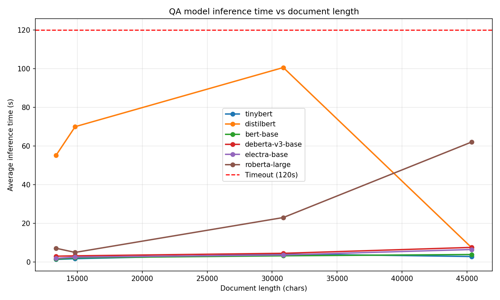

# AI Document Insight Service

A chat-based document QA application. Upload PDF or image documents (or add URLs), create multiple chats, and ask questions about your content. Uses the Hugging Face Inference API for QA. Built for a technical interview.

## Features

- **Chat-based UI**: Multiple chats with document and message persistence
- **Document upload**: PDF and images (`.pdf`, `.png`, `.jpg`, `.jpeg`), plus URL ingestion
- **QA model selection**: Choose from several SQuAD-trained models (TinyBERT, RoBERTa, BERT Large)
- **Frontend**: React + Vite, served from the same origin in production

## Setup

### Prerequisites

- Python 3.12+
- [uv](https://docs.astral.sh/uv/) (or `pip install uv`)
- Node.js 18+ (for frontend dev)

### Install and Run

**Backend only:**

```bash
uv sync
uv run uvicorn app.main:app --reload --host 0.0.0.0 --port 8000
```

API at `http://localhost:8000`.

**Full app with frontend (dev):**

```bash
# Terminal 1: backend
uv sync && uv run uvicorn app.main:app --reload --host 0.0.0.0 --port 8000

# Terminal 2: frontend (proxies API to backend)
cd frontend && npm install && npm run dev
```

For reproducible Docker builds, run `npm install` in `frontend/` and commit `package-lock.json`.

Frontend runs at `http://localhost:5173` and proxies API requests to the backend.

**Docker:**

`HF_TOKEN` required for QA and Docker. Copy `.env.example` to `.env` and set your token.

```bash
# Docker Compose (recommended)
cp .env.example .env
# Edit .env and set HF_TOKEN=your_token
docker compose up --build

# Plain Docker
docker build -t doc-insight .
docker run -p 8000:8000 -e HF_TOKEN=your_token doc-insight
```

The app will be available at `http://localhost:8000`. Frontend is built into the image and served by FastAPI. First build downloads EasyOCR (~500MB+); subsequent builds use cache.

### Environment Variables

| Variable | Required | Description |
|----------|----------|-------------|
| `HF_TOKEN` | Yes | Hugging Face token for Inference API (QA, NER) |
| `DB_PATH` | No | SQLite path (default: `./data/chat.db`) |
| `VITE_API_URL` | No | API base URL when frontend is deployed separately |

---

## Testing

```bash
# Run fast tests only (unit + API integration; excludes slow model/OCR tests)
uv run pytest -m "not slow"

# Run full test suite (includes slow extraction and QA model tests)
uv run pytest

# Run with verbose output
uv run pytest -v
```

**First-time setup:** For extraction and upload tests, generate test documents:

```bash
uv run python scripts/generate_test_docs.py
```

**Validation scripts:**

```bash
# Run all validations (storage, extraction, QA)
uv run python scripts/validate_all.py
```

---

## API

Interactive docs at `http://localhost:8000/docs`.

### Chat endpoints

| Method | Endpoint | Description |
|--------|----------|-------------|
| GET | `/chats` | List chats |
| POST | `/chats` | Create chat |
| GET | `/chats/{id}` | Get chat with documents and messages |
| PATCH | `/chats/{id}` | Update chat title |
| POST | `/chats/{id}/upload` | Upload files |
| POST | `/chats/{id}/add-urls` | Add documents from URLs |
| POST | `/chats/{id}/ask` | Ask question (body: `question`, `document_ids?`, `model_id?`) |
| PATCH | `/chats/{id}/documents/{doc_id}` | Toggle document enabled |
| GET | `/qa/models` | List QA models |

### Examples

**Create chat and upload:**

```bash
CHAT_ID=$(curl -s -X POST http://localhost:8000/chats \
  -H "Content-Type: application/json" \
  -d '{}' | jq -r '.id')

curl -X POST "http://localhost:8000/chats/${CHAT_ID}/upload" \
  -F "files=@sample.pdf"
```

Response (create chat): `{"id": "550e8400-e29b-41d4-a716-446655440000"}`

Response (upload): `{"document_ids": ["doc-uuid"], "failed": null}`

**Ask a question:**

```bash
curl -X POST "http://localhost:8000/chats/${CHAT_ID}/ask" \
  -H "Content-Type: application/json" \
  -d '{"question": "What is the main topic?"}'
```

Response: `{"answer": "The main topic is...", "model_used": "tinybert", "inference_time": 0.42}`

### Health

```bash
curl -s http://localhost:8000/health
# {"status":"ok"}
```

---

## Approach

### Stack and Tooling

See the **Stack Card** table below. Built with Cursor; quality ensured by unit/integration tests and ongoing review.

### Validation Suite

Test structure: [plans/comprehensive_pytest_test_suite_3c03307d.plan.md](plans/comprehensive_pytest_test_suite_3c03307d.plan.md). **Unit tests** (`pytest -m "not slow"`): extraction, storage, QA pipeline, NER pipeline, schemas. **Integration**: API (health, chats CRUD, upload, add-urls, ask with mocked HF) and static serving. **Slow tests** (`@pytest.mark.slow`): real PDF/OCR and QA inference—require `HF_TOKEN` and `test_docs/`. **Validation scripts** ([scripts/](scripts/)): `validate_storage.py`, `validate_extraction.py`, `validate_qa.py`, `validate_all.py`—manual sanity checks; QA needs `HF_TOKEN`. **Fixtures** ([tests/conftest.py](tests/conftest.py)): `chat_repo`, `client` (mocked HF), `sample_pdf_path`/`sample_pdf_bytes` (see Testing if missing).

### Development Phases

Phases 1–6: scaffold → extraction → storage → QA pipeline → API endpoints → Docker. Then: [chat persistence](plans/chat_persistence_and_history_0d3716ef.plan.md) (SQLite, new API), [HF Inference migration](plans/hf_inference_api_migration_30509893.plan.md), [NER overview](plans/ner_document_overview_cd6b0b50.plan.md), [pytest suite](plans/comprehensive_pytest_test_suite_3c03307d.plan.md).

| Phase | Scope | Plan |
|-------|-------|------|
| 1. Project scaffold | FastAPI app, `/health`, config, uv | [phase_1_project_scaffold](plans/phase_1_project_scaffold_b9cbaf07.plan.md) |
| 2. Document extraction | PyMuPDF, EasyOCR, extractor router, test_docs | [phase_2_document_extraction](plans/phase_2_document_extraction_6073692c.plan.md) |
| 3. Storage layer | In-memory SessionStore, add/get, session isolation | [phase_3_storage_layer](plans/phase_3_storage_layer_2f3ccae9.plan.md) |
| 4. QA pipeline | Local transformers, TinyBERT, chunking | [phase_4_qa_pipeline](plans/phase_4_qa_pipeline_406aa8a8.plan.md) |
| 5. API endpoints | POST /upload, POST /ask, X-Session-ID | [phase_5_api_endpoints](plans/phase_5_api_endpoints_5ac943c1.plan.md) |
| 6. Docker | Multi-stage Dockerfile, model preload | [phase_6_docker](plans/phase_6_docker_b6e02009.plan.md) |
| Chat persistence | SQLite, chats/documents/messages, new API | [chat_persistence_and_history](plans/chat_persistence_and_history_0d3716ef.plan.md) |
| HF Inference migration | Local models → HF Inference API | [hf_inference_api_migration](plans/hf_inference_api_migration_30509893.plan.md) |
| Frontend | React + Vite, multi-chat, model dropdown, URL | [chat_persistence](plans/chat_persistence_and_history_0d3716ef.plan.md) Phase 5 |
| NER | Entity extraction at upload, Containing panel | [ner_document_overview](plans/ner_document_overview_cd6b0b50.plan.md) |
| Test suite | Unit, integration, slow markers | [comprehensive_pytest_test_suite](plans/comprehensive_pytest_test_suite_3c03307d.plan.md) |

### Stack Card


| Component | Choice | Rationale |
|-----------|--------|------------|
| **PDF extraction** | PyMuPDF (fitz) | Fast, pure Python bindings, handles text PDFs well |
| **Image extraction** | EasyOCR | Supports English, good for scanned docs; uses torch/torchvision/transformers |
| **QA** | Hugging Face Inference API | Serverless, no local model load; multiple model options |
| **Storage** | SQLite | Chat, document, and message persistence |
| **Framework** | FastAPI | Async, automatic OpenAPI docs, Pydantic validation |
| **Frontend** | React + Vite | Built into Docker image, served by FastAPI |
| **Package manager** | uv | Fast installs, lockfile, reproducible builds |

### Inference and Models

The Hugging Face Inference API enforces a **120-second timeout** per request. Document chunking, model selection, and context limits are tuned to stay within it. See [benchmark/README.md](benchmark/README.md) for latency profiling and how to run the benchmark.

| Model | Weights | Task | Description |
|-------|---------|------|--------------|
| **PyMuPDF (fitz)** | N/A | PDF extraction | Rule-based text extraction; no neural model. Fast, pure Python bindings. |
| **EasyOCR** | CRAFT ~79MB + CRNN | OCR | CRAFT for text detection, ResNet-based CRNN for recognition. English (`en`). Runs locally; first run downloads ~500MB+. |
| **dslim/bert-base-NER** | 110M | NER | BERT-base-cased fine-tuned on CoNLL-2003. Entity types: PER, ORG, LOC, MISC. Chunked for long text. |
| **Intel/dynamic_tinybert** | ~67M | QA | TinyBERT-6L (6 layers, 768 hidden). SQuAD 1.1. Default QA model. Dynamic sequence-length reduction; up to 3.3x speedup vs BERT. |
| **deepset/deberta-v3-base-squad2** | 184M | QA | DeBERTa v3 base. Improved attention; strong on SQuAD 2.0. |
| **deepset/electra-base-squad2** | 110M | QA | ELECTRA-base. Discriminator pre-training; efficient. |
| **deepset/roberta-large-squad2** | 355M | QA | RoBERTa large. Highest accuracy; slowest. SQuAD 2.0 EM 85.17%, F1 88.35%. |

#### Model Latency Profile

We benchmark QA inference times across documents of varying length. The chart below plots average inference time (seconds) vs document length (characters) for each QA model.



**Low-latency models** (TinyBERT, DeBERTa v3 base, ELECTRA base) stay under ~5 seconds across 12.5k–45k characters. **RoBERTa large** scales with length—~7s at 13k to ~60s+ at 45k—best for shorter docs or when accuracy justifies the wait. The red dashed line marks the 120s limit; models approaching it risk timeouts.

Note: The models in use are public-access; therefore it is not always likely that our benchmark provides an exact result all-round—latency varies with availability of compute resources, hinging on whether the model is under high load by other users of the HF Inference platform. One can observe high or low latency on high- or low-parameter models, making it somewhat unintuitive compared to self-hosting, where latency is a function of parameter count.

---

## Project Structure

```
solo-interview-project-1/
├── app/
│   ├── main.py
│   ├── config.py
│   ├── hf_client.py
│   ├── api/
│   │   ├── router.py
│   │   ├── deps.py
│   │   ├── chats.py
│   │   ├── documents.py
│   │   ├── ask.py
│   │   └── schemas.py
│   ├── extraction/
│   │   ├── pdf.py, ocr.py, extractor.py, url.py
│   │   └── exceptions.py
│   ├── ner/
│   │   ├── __init__.py
│   │   └── pipeline.py
│   ├── storage/
│   │   ├── db.py
│   │   ├── chat_repository.py
│   │   └── exceptions.py
│   └── qa/
│       ├── pipeline.py
│       └── preload.py
├── frontend/
│   ├── src/
│   │   ├── App.jsx
│   │   ├── ChatSidebar.jsx, ChatHeader.jsx, MessageList.jsx
│   │   ├── InputArea.jsx, DocumentSidebar.jsx
│   │   ├── UploadModal.jsx, Toast.jsx
│   │   ├── api.js
│   │   └── main.jsx
│   └── package.json
├── tests/
├── scripts/
├── docker-compose.yml
├── Dockerfile
├── pyproject.toml
├── .env.example
└── README.md
```
