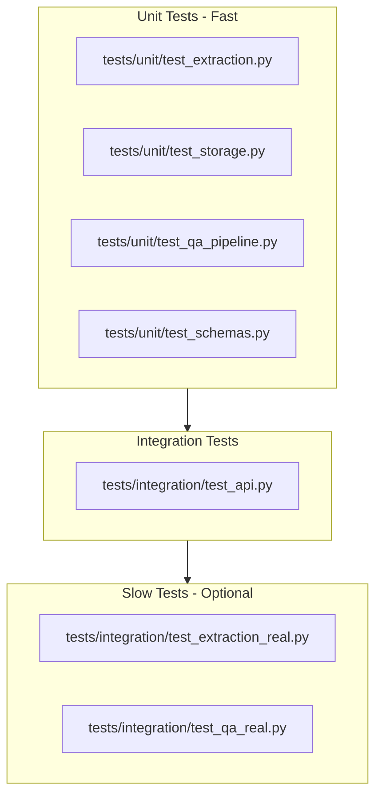

# Comprehensive Pytest Test Suite Plan

## Current State

- **No pytest**: pytest is not in [pyproject.toml](pyproject.toml); only `.pytest_cache/` in `.gitignore`
- **Validation scripts** in [scripts/](scripts/) (validate_extraction, validate_storage, validate_qa) provide manual validation logic that can inform test cases
- **App structure**: [app/main.py](app/main.py), [app/api/router.py](app/api/router.py), [app/extraction/](app/extraction/), [app/storage/](app/storage/), [app/qa/](app/qa/)
- **Test docs**: Generated by [scripts/generate_test_docs.py](scripts/generate_test_docs.py) → `test_docs/sample.pdf`, `test_docs/sample.png`

## Test Architecture




---

## 1. Pytest Setup

**Add to [pyproject.toml](pyproject.toml):**

- `pytest` and `httpx` (for `TestClient`) to `[dependency-groups] dev`
- Optional: `pytest-asyncio` if async tests needed (FastAPI TestClient is sync-compatible)

**Create [pytest.ini](pytest.ini) or `[tool.pytest.ini_options]` in pyproject.toml:**

- `testpaths = tests`
- `pythonpath = .` (or use `conftest.py` with `sys.path`)
- `markers`: `slow` for tests that load models/OCR
- `addopts = -v` for verbose output

---

## 2. Test Directory Structure

```
tests/
├── conftest.py           # Fixtures: TestClient, fresh app, test file bytes
├── unit/
│   ├── __init__.py
│   ├── test_extraction.py
│   ├── test_storage.py
│   ├── test_qa_pipeline.py
│   └── test_schemas.py
└── integration/
    ├── __init__.py
    ├── test_api.py
    ├── test_extraction_real.py   # @pytest.mark.slow
    └── test_qa_real.py           # @pytest.mark.slow
```

---

## 3. Unit Tests

### 3.1 [tests/unit/test_storage.py](tests/unit/test_storage.py)

**Reference:** [scripts/validate_storage.py](scripts/validate_storage.py), [DEVELOPMENT_PLAN.md](DEVELOPMENT_PLAN.md) Phase 3 validation


| Test Case                                        | Assertion                                                |
| ------------------------------------------------ | -------------------------------------------------------- |
| `add_documents` creates session and stores texts | `get_documents("s1") == ["doc1", "doc2"]`                |
| `add_documents` appends to existing session      | Second add → `["doc1", "doc2", "doc3"]`                  |
| Session isolation                                | Docs in s1 not visible in s2                             |
| `get_documents` unknown session                  | Raises `SessionNotFoundError`                            |
| Empty list add                                   | `add_documents("s1", [])` does not crash; session exists |


### 3.2 [tests/unit/test_extraction.py](tests/unit/test_extraction.py)

**Reference:** [scripts/validate_extraction.py](scripts/validate_extraction.py), [app/extraction/extractor.py](app/extraction/extractor.py)


| Test Case                      | Approach                                                                                         |
| ------------------------------ | ------------------------------------------------------------------------------------------------ |
| Unsupported file type (`.txt`) | Raises `UnsupportedFileTypeError`                                                                |
| Nonexistent file               | Raises `ExtractionError`                                                                         |
| File type routing              | Mock `extract_text_from_pdf` / `extract_text_from_image`; verify correct one called by extension |


**Note:** Real PDF/OCR extraction tests go in `test_extraction_real.py` (slow) and require `test_docs/` to exist.

### 3.3 [tests/unit/test_qa_pipeline.py](tests/unit/test_qa_pipeline.py)

**Reference:** [scripts/validate_qa.py](scripts/validate_qa.py), [app/qa/pipeline.py](app/qa/pipeline.py)


| Test Case                             | Approach                                                               |
| ------------------------------------- | ---------------------------------------------------------------------- |
| Empty context (str)                   | Returns `EMPTY_CONTEXT_FALLBACK`                                       |
| Empty context (list)                  | Returns fallback                                                       |
| Empty context (list of empty strings) | Returns fallback                                                       |
| `_normalize_context`                  | Test list→string concatenation, stripping                              |
| Basic QA with mocked pipeline         | `patch` transformers pipeline; assert `answer()` returns mocked result |


**Note:** Real model tests in `test_qa_real.py` (slow).

### 3.4 [tests/unit/test_schemas.py](tests/unit/test_schemas.py)


| Test Case                 | Assertion                           |
| ------------------------- | ----------------------------------- |
| AskRequest valid          | `question`, `session_id` required   |
| AskRequest missing fields | ValidationError                     |
| UploadResponse            | `message`, `documents_added` fields |


---

## 4. Integration Tests (API)

### 4.1 Dependency Override for Isolated Tests

**Problem:** [app/api/router.py](app/api/router.py) uses module-level `store = SessionStore()`. Tests would share state.

**Solution:** Refactor router to use FastAPI `Depends()` for `SessionStore`, then override in tests:

```python
# In router.py: add get_store dependency
def get_store() -> SessionStore:
    return store  # or use lru_cache for singleton

# In upload/ask: inject store via Depends(get_store)
```

In [tests/conftest.py](tests/conftest.py):

- Override `get_store` to return a fresh `SessionStore()` per test
- Use `app.dependency_overrides[get_store] = lambda: SessionStore()` in a fixture

### 4.2 [tests/integration/test_api.py](tests/integration/test_api.py)

**Reference:** [DEVELOPMENT_PLAN.md](DEVELOPMENT_PLAN.md) Phase 5 validation, [README.md](README.md) API section


| Test Case                             | Status | Assertion                        |
| ------------------------------------- | ------ | -------------------------------- |
| `GET /health`                         | 200    | `{"status": "ok"}`               |
| `POST /upload` missing `X-Session-ID` | 400    | `detail` contains "Missing"      |
| `POST /upload` no files               | 400    | `detail` "No files provided"     |
| `POST /upload` file with no filename  | 400    | `detail` "no filename"           |
| `POST /upload` unsupported file type  | 422    | `detail` "Unsupported file type" |
| `POST /upload` valid PDF              | 200    | `documents_added >= 1`           |
| `POST /ask` unknown session           | 404    | `detail` "Session not found"     |
| `POST /ask` with docs                 | 200    | `answer` non-empty string        |
| `POST /ask` invalid JSON              | 422    | FastAPI validation               |


**Fixtures:**

- PDF bytes: Use `test_docs/sample.pdf` if exists, or create minimal PDF in memory (e.g. via PyMuPDF `fitz.open()` stream) for upload tests
- Session ID: Use `uuid.uuid4().hex` or fixed `"test-session"` with fresh store

---

## 5. Slow / Real Integration Tests

Mark with `@pytest.mark.slow`. Run with `pytest -m "not slow"` for fast CI.

### 5.1 [tests/integration/test_extraction_real.py](tests/integration/test_extraction_real.py)

- Require `test_docs/sample.pdf` and `test_docs/sample.png` (skip if missing, or generate in `conftest.py`)
- PDF extraction returns non-empty text, contains `expected_keyword`
- Image extraction returns non-empty text

### 5.2 [tests/integration/test_qa_real.py](tests/integration/test_qa_real.py)

- Basic QA: context "contract expires March 15, 2025" → answer contains "March"/"15"/"2025"
- Long context: no crash, relevant answer

---

## 6. Fixtures and conftest.py

** [tests/conftest.py](tests/conftest.py):**

- `client`: `TestClient(app)` with dependency override for `SessionStore`
- `sample_pdf_path`: Path to `test_docs/sample.pdf`; skip tests if missing
- `sample_pdf_bytes`: Bytes for upload (read from file or generate)
- `app_with_fresh_store`: Factory for app with overridden store (if not using module-level override)

---

## 7. Test Data and Setup

- **test_docs**: Run `uv run python scripts/generate_test_docs.py` before tests, or add a `conftest.py` fixture that generates if missing
- **CI**: Add `generate_test_docs` as a pytest fixture with `scope="session"` or document in README that tests require `test_docs/`

---

## 8. pyproject.toml Updates

```toml
[dependency-groups]
dev = [
    "pillow>=12.1.1",
    "pytest>=8.0.0",
    "httpx>=0.27.0",
]

[tool.pytest.ini_options]
testpaths = ["tests"]
pythonpath = ["."]
markers = [
    "slow: marks tests as slow (deselect with '-m \"not slow\"')",
]
addopts = "-v"
```

---

## 9. README / Docs

- Add "Testing" section: `uv run pytest` (fast), `uv run pytest -m "not slow"` for CI, `uv run pytest` for full suite
- Note: Run `uv run python scripts/generate_test_docs.py` before first test run for extraction/upload tests

---

## 10. Implementation Order

1. Add pytest, httpx to dev deps; add pytest config
2. Create `tests/` structure and `conftest.py`
3. Refactor router for `SessionStore` dependency injection (minimal change)
4. Unit tests: storage, extraction (mocked), qa (mocked), schemas
5. Integration tests: API (health, upload, ask)
6. Slow tests: extraction real, qa real
7. Update README

---

## Key Files Summary


| File                                                           | Purpose                                 |
| -------------------------------------------------------------- | --------------------------------------- |
| [pyproject.toml](pyproject.toml)                               | Add pytest, httpx; pytest config        |
| [app/api/router.py](app/api/router.py)                         | Add `get_store` dependency for override |
| [tests/conftest.py](tests/conftest.py)                         | Fixtures, TestClient, store override    |
| [tests/unit/test_*.py](tests/unit/)                            | Unit tests                              |
| [tests/integration/test_api.py](tests/integration/test_api.py) | API integration tests                   |
| [tests/integration/test_*_real.py](tests/integration/)         | Slow real-model tests                   |


