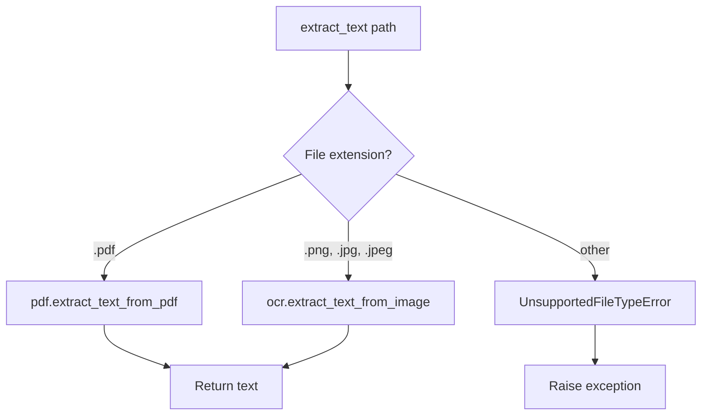

# Phase 2: Document Extraction

## Current State

Phase 1 is complete. The project has:

- [app/main.py](app/main.py) with FastAPI and `/health` endpoint
- [app/config.py](app/config.py) with `UPLOAD_DIR` and `SESSION_TIMEOUT`
- [pyproject.toml](pyproject.toml) with fastapi, uvicorn, python-multipart (uv-managed)

**Missing for Phase 2:** `app/extraction/` module, PyMuPDF dependency, test documents.

---

## Implementation Steps

### 1. Add Dependencies

Add both PyMuPDF and EasyOCR:

```bash
uv add PyMuPDF easyocr
```

Update [pyproject.toml](pyproject.toml) accordingly. EasyOCR adds ~500MB; first run downloads model.

### 2. Create `app/extraction/` Package

- Create `app/extraction/__init__.py` (empty or export `extract_text`)
- Create `app/extraction/pdf.py`:
  - Function: `extract_text_from_pdf(path: str) -> str`
  - Use `fitz.open(path)` (PyMuPDF), iterate pages, `page.get_text()`, concatenate
  - Raise custom exceptions: e.g. `ExtractionError` for file not found, corrupt PDF
  - Close document in `try/finally` or context manager

### 3. Create `app/extraction/ocr.py` (Image Support)

- Function: `extract_text_from_image(path: str) -> str`
- Use EasyOCR: `reader = easyocr.Reader(['en'])`, `reader.readtext(path)`
- Concatenate detected text from results
- Raise custom exceptions for unsupported format, corrupt file
- **Note:** First EasyOCR call downloads ~100MB model; consider lazy init

### 4. Create `app/extraction/extractor.py` (Router)

- Function: `extract_text(file_path: str) -> str`
- Infer type from extension (`.pdf` → pdf, `.png`/`.jpg`/`.jpeg` → ocr)
- Call appropriate module; return extracted text
- Raise custom exceptions: e.g. `UnsupportedFileTypeError` for unknown extensions; let `ExtractionError` propagate from pdf/ocr modules
- Define exceptions in `app/extraction/exceptions.py` or at module level




### 5. Add Test Documents to `test_docs/`

Create `test_docs/` directory and add:


| File         | Purpose                                                |
| ------------ | ------------------------------------------------------ |
| `sample.pdf` | Text PDF with known content (e.g., "expected_keyword") |
| `sample.png` | Image with text for OCR validation                     |


**Approach:** Create `scripts/generate_test_docs.py` that programmatically generates both:

- PDF: Use PyMuPDF (fitz) to create a PDF with known text (e.g., "expected_keyword", "contract expires March 15 2025")
- Image: Use Pillow to create a PNG with text drawn on it
- Add Pillow as dev dependency for the script: `uv add --dev pillow`

### 6. Validation Script (Optional but Recommended)

Create `scripts/validate_extraction.py`:

```python
# Conceptual structure
from app.extraction.extractor import extract_text

# PDF
pdf_text = extract_text("test_docs/sample.pdf")
assert len(pdf_text) > 0
# assert "expected_keyword" in pdf_text.lower()

# Image (if OCR added)
img_text = extract_text("test_docs/sample.png")
assert len(img_text) > 0

# Invalid file (should not crash)
# extract_text("nonexistent.pdf")  # expect empty or clear error
```

---

## File Summary


| File                             | Purpose                                          |
| -------------------------------- | ------------------------------------------------ |
| `app/extraction/__init__.py`     | Package marker, optionally export `extract_text` |
| `app/extraction/pdf.py`          | `extract_text_from_pdf(path)` via PyMuPDF        |
| `app/extraction/ocr.py`          | `extract_text_from_image(path)` via EasyOCR      |
| `app/extraction/extractor.py`    | `extract_text(path)` — routes by file type       |
| `test_docs/sample.pdf`           | Test PDF                                         |
| `test_docs/sample.png`           | Test image                                       |
| `scripts/generate_test_docs.py`  | (Optional) Generate test documents               |
| `scripts/validate_extraction.py` | (Optional) Validation script                     |


---

## Validation Commands (from Plan)

```bash
# Quick one-liner after implementation
uv run python -c "
from app.extraction.extractor import extract_text
t = extract_text('test_docs/sample.pdf')
print('OK' if t and len(t) > 0 else 'FAIL')
"
```

---

## Success Criteria

- PDF extraction returns non-empty text for valid PDF
- Image extraction returns non-empty text for valid image (if OCR added)
- Invalid/corrupt files handled without crash
- File type routing: PDF → PyMuPDF, image → OCR

---

## Design Decisions to Clarify

1. **EasyOCR vs PDF-only:** Including EasyOCR satisfies image validation but adds ~500MB. Alternative: PDF-only for Phase 2, add OCR in a later iteration.
2. **Test doc source:** Generate programmatically vs. add pre-made samples. Programmatic ensures known keywords for assertions.
3. **Error handling:** Return `""` for corrupt files vs. raise custom exception. Plan says "graceful error or empty string" — either is acceptable; document the choice.

