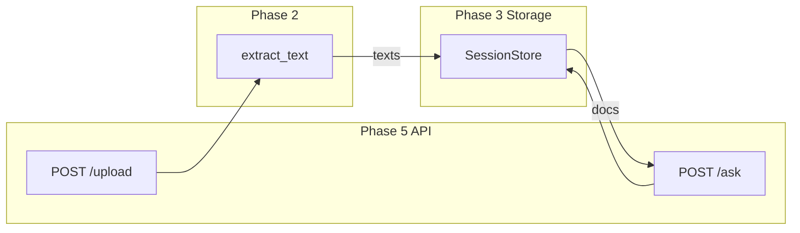

# Phase 3: Storage Layer

## Current State

Phase 1 and Phase 2 are complete. The project has:

- [app/main.py](app/main.py) with FastAPI and `/health` endpoint
- [app/config.py](app/config.py) with `UPLOAD_DIR` and `SESSION_TIMEOUT`
- [app/extraction/](app/extraction/) with `extract_text()`, PDF and OCR support, test docs in `test_docs/`

**Missing for Phase 3:** `app/storage/` module for session-scoped document storage.

---

## Implementation Steps

### 1. Create `app/storage/` Package

- Create `app/storage/__init__.py` (export `SessionStore`, `SessionNotFoundError`)
- Create `app/storage/exceptions.py` with `SessionNotFoundError`
- Create `app/storage/session_store.py`

### 2. Implement `app/storage/session_store.py`

**Data structure:** In-memory `dict[str, list[str]]` mapping `session_id` to list of extracted document texts.

**API:**

- `add_documents(session_id: str, texts: list[str]) -> None` — append texts to the session's document list (create session if missing)
- `get_documents(session_id: str) -> list[str]` — return documents for session; raise `SessionNotFoundError` for unknown session

**Resolved design decisions:**

- **Unknown session:** Raise `SessionNotFoundError` (explicit error handling)
- **Append behavior:** `add_documents` appends; existing session `["a"]` + `add_documents("s1", ["b"])` yields `["a", "b"]`
- **Disk persistence:** Deferred; in-memory only for Phase 3
- **Thread safety:** Single-threaded FastAPI/uvicorn is fine for a simple `dict`. If using workers, consider `threading.Lock` or `asyncio.Lock` for concurrent access.
- **Session ID source:** Phase 3 storage is agnostic — it receives `session_id` strings from callers. The source (header, query param, auto-generated) is decided in Phase 5 when wiring API endpoints.

### 3. Validation Script (Optional)

Create `scripts/validate_storage.py`:

```python
# Conceptual structure
from app.storage.session_store import SessionStore
from app.storage.exceptions import SessionNotFoundError

store = SessionStore()
store.add_documents("s1", ["doc1 text", "doc2 text"])
docs = store.get_documents("s1")
assert docs == ["doc1 text", "doc2 text"]
# Unknown session raises SessionNotFoundError
try:
    store.get_documents("s2")
except SessionNotFoundError:
    pass  # expected
# Session isolation: s1 docs not visible in s2
```

---

## File Summary


| File                           | Purpose                                                       |
| ------------------------------ | ------------------------------------------------------------- |
| `app/storage/__init__.py`      | Package marker, export `SessionStore`, `SessionNotFoundError` |
| `app/storage/exceptions.py`    | `SessionNotFoundError`                                        |
| `app/storage/session_store.py` | In-memory `dict`, `add_documents()`, `get_documents()`        |
| `scripts/validate_storage.py`  | (Optional) Validation script                                  |


---

## Data Flow (Phase 5 Preview)




---

## Validation Commands

```bash
# Quick one-liner after implementation
uv run python -c "
from app.storage.session_store import SessionStore
from app.storage.exceptions import SessionNotFoundError
s = SessionStore()
s.add_documents('s1', ['a', 'b'])
ok = s.get_documents('s1') == ['a', 'b']
try:
    s.get_documents('s2')
    ok = False
except SessionNotFoundError:
    pass
print('OK' if ok else 'FAIL')
"
```

---

## Success Criteria (from DEVELOPMENT_PLAN)

- Documents stored and retrieved correctly per session
- Sessions are isolated (docs in "s1" not visible in "s2")
- Unknown session raises `SessionNotFoundError`

