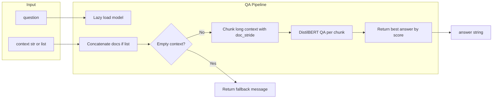

# Phase 4: QA Pipeline Implementation

## Current State

Phases 1–3 are complete. The project has:

- [app/main.py](app/main.py) with FastAPI and `/health`
- [app/extraction/](app/extraction/) with PDF and OCR extraction
- [app/storage/session_store.py](app/storage/session_store.py) with `add_documents` and `get_documents` returning `list[str]`

**Missing for Phase 4:** `app/qa/` module, transformers and torch dependencies.

---

## Implementation Steps

### 1. Add Dependencies

Add transformers and torch to [pyproject.toml](pyproject.toml):

```bash
uv add transformers torch
```

Note: torch is large (~2GB for CPU). The project uses `uv` for dependency management.

### 2. Create `app/qa/` Package

- Create `app/qa/__init__.py` (empty or export `answer`)
- Create `app/qa/pipeline.py` with:
  - **Lazy model loading:** Use a module-level `_pipeline` variable (or similar) initialized to `None`. On first `answer()` call, load `pipeline("question-answering", model="distilbert/distilbert-base-cased-distilled-squad")` and cache it.
  - `**answer(question: str, context: str | list[str]) -> str**`:
    - If `context` is `list[str]`, concatenate with newlines or spaces into a single string.
    - If context is empty (empty string or empty list / all empty strings), return a fallback message (e.g. `"No context provided."`) without calling the model.
    - For non-empty context, call the pipeline with `question` and `context`, passing chunking parameters so long documents are processed correctly.
    - Return the `answer` field from the pipeline result.

### 3. Context Length Handling (Chunking)

Use the transformers QA pipeline's built-in chunking for long contexts. When context + question exceeds the model limit (512 tokens), the pipeline splits the context into overlapping chunks and returns the best answer across chunks.

**Parameters to pass when calling the pipeline:**

- `**max_seq_len**` (default 384): Max tokens per chunk (question + context). Leave headroom for the question (~64–128 tokens). 384 is a common choice.
- `**doc_stride**` (default 128): Overlap between consecutive chunks. Ensures answers spanning chunk boundaries are not lost.
- `**handle_impossible_answer**` (optional): Set to `True` if the pipeline supports it, so unanswerable questions return a sensible fallback instead of garbage.

**Implementation:** Pass these as kwargs when calling the pipeline, e.g.:

```python
result = _pipeline(question=question, context=context, max_seq_len=384, doc_stride=128)
```

The pipeline automatically chunks long contexts, runs inference on each chunk, and returns the answer with the highest score. No manual chunking logic required.

### 4. Validation Script

Create `scripts/validate_qa.py` following the pattern of [scripts/validate_storage.py](scripts/validate_storage.py):

- Import `answer` from `app.qa.pipeline`
- **Basic QA:** `ctx = "The contract expires on March 15, 2025. The vendor is Acme Corp."` → `answer("When does the contract expire?", ctx)` → assert result contains "March", "15", or "2025"
- **Empty context:** `answer("What?", "")` → assert result is not None and is a fallback message (e.g. contains "context" or "No")
- **Long context (chunking):** Pass a context longer than ~400 tokens (e.g. 3000+ chars); assert no crash and that the answer is relevant (chunking works)
- Exit 0 on success, 1 on failure; print OK/FAIL per check

---

## Data Flow




---

## Key Files


| File                                             | Purpose                                                                 |
| ------------------------------------------------ | ----------------------------------------------------------------------- |
| [app/qa/**init**.py](app/qa/__init__.py)         | Package init, optionally export `answer`                                |
| [app/qa/pipeline.py](app/qa/pipeline.py)         | Lazy-loaded pipeline, `answer(question, context)`                       |
| [scripts/validate_qa.py](scripts/validate_qa.py) | Validation script for model load, basic QA, empty context, long context |


---

## Validation Commands

```bash
# Run validation script
python scripts/validate_qa.py

# Quick one-liner
python -c "
from app.qa.pipeline import answer
ctx = 'The contract expires on March 15, 2025.'
ans = answer('When does the contract expire?', ctx)
print('OK' if ans and ('March' in ans or '15' in ans or '2025' in ans) else 'FAIL')
"
```

---

## Success Criteria (from DEVELOPMENT_PLAN.md)

- Model loads on first call
- Answer is relevant to question and context
- Empty context handled gracefully
- Long context handled via chunking (no token overflow)

