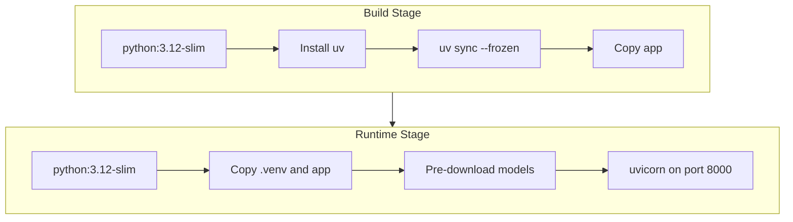

# Phase 6: Docker Implementation Plan

## Current State

- **App structure**: FastAPI app in [app/](app/) with `/health`, `POST /upload`, `POST /ask`
- **Dependencies**: Managed by [pyproject.toml](pyproject.toml) and [uv.lock](uv.lock) (uv)
- **Models**: Lazy-loaded on first use:
  - Transformers: `distilbert-base-cased-distilled-squad` ([app/qa/pipeline.py](app/qa/pipeline.py))
  - EasyOCR: English model ([app/extraction/ocr.py](app/extraction/ocr.py))
- **Entry point**: `uvicorn app.main:app --host 0.0.0.0 --port 8000`
- **No Dockerfile or .dockerignore** exist yet

## Architecture




## Implementation Steps

### 1. Create `.dockerignore`

Exclude files that should not be copied into the build context:

- `.venv/`, `venv/`, `env/` — local virtual environments
- `__pycache__/`, `*.pyc`, `.pytype/`, `.mypy_cache/`, `.ruff_cache/`
- `.git/`, `.gitignore`
- `*.md` (except `README.md` if needed), `plans/`, `DEVELOPMENT_PLAN.md`, `TechAsignements_*.txt`
- `test_docs/` — optional; exclude to keep image smaller (validation uses host files)
- `.env`, `.envrc`, `.cursorignore`
- `*.egg-info/`, `dist/`, `build/`

### 2. Create `Dockerfile` (multi-stage)

**Stage 1 — Builder**

- Base: `python:3.12-slim`
- Install `uv` (e.g. via `pip install uv` or official installer)
- `WORKDIR /app`
- `COPY pyproject.toml uv.lock ./`
- `RUN uv sync --frozen --no-dev` — installs deps into `.venv`
- `COPY app ./app`

**Stage 2 — Runtime**

- Base: `python:3.12-slim`
- `WORKDIR /app`
- Copy `.venv` from builder: `COPY --from=builder /app/.venv /app/.venv`
- Copy app: `COPY --from=builder /app/app ./app`
- `ENV PATH="/app/.venv/bin:$PATH"`
- **Model pre-download** — inline `RUN python -c "..."` (see step 3)
- `EXPOSE 8000`
- `CMD ["uvicorn", "app.main:app", "--host", "0.0.0.0", "--port", "8000"]`

**Notes**

- Use `--no-dev` so dev deps (e.g. `pillow` in dev group) are not installed in the image
- `uv sync --frozen` uses `uv.lock` for reproducible installs

### 3. Model pre-download (inline in Dockerfile)

Pre-download both models at build time using an inline `RUN` in the runtime stage. HuggingFace and EasyOCR caches are written directly into the final image.

Add to the runtime stage, after `ENV PATH` and before `EXPOSE`:

```dockerfile
RUN python -c "\
from app.qa.pipeline import _get_pipeline;\
from app.extraction.ocr import _get_reader;\
_get_pipeline();\
_get_reader()\
"
```

### 4. Validation

After implementation, run:

```bash
# Build
docker build -t doc-insight .

# Run (background)
docker run -d -p 8000:8000 --name doc-insight-test doc-insight

# Validate
curl -s http://localhost:8000/health
curl -X POST http://localhost:8000/upload -H "X-Session-ID: d1" -F "files=@test_docs/sample.pdf"
curl -X POST http://localhost:8000/ask -H "Content-Type: application/json" -d '{"question":"What?","session_id":"d1"}'

# Cleanup
docker stop doc-insight-test && docker rm doc-insight-test
```

## File Summary


| File | Action |
|------|--------|
| [.dockerignore](.dockerignore) | Create — exclude venv, cache, git, docs, etc. |
| [Dockerfile](Dockerfile) | Create — multi-stage build with uv + inline model pre-download |


## Success Criteria (from DEVELOPMENT_PLAN.md)

- Image builds without error
- Container runs and serves requests
- Upload and Ask work from host

## Considerations

- **Image size**: `torch` is large (~2GB). Multi-stage build avoids build tools in the final image but the runtime image will still be large. Using `python:3.12-slim` keeps the base smaller.
- **test_docs**: Validation curls use `test_docs/sample.pdf` from the host; the container does not need `test_docs` inside the image.
- **Platform**: Default is linux/amd64. For ARM (e.g. Apple Silicon), use `--platform linux/amd64` or build natively.

